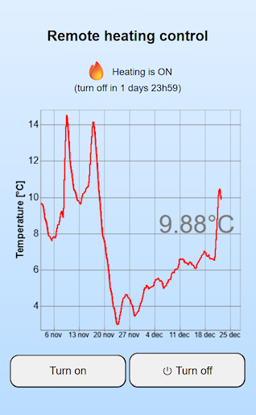

# Simple WebApp embedding Yocto-Visualization for Web

This demo project shows how to build a WebApp that can remotely control a relay to switch heating
On/Off, and show the history of measured temperatures.

It does not depend on any proprietary infrastructure, as remote control is handled by an instance of 
[VirtualHub for Web](https://www.yoctopuce.com/EN/article/new-a-virtualhub-that-works-through-the-web),
which you are free to install on the host of your choice, and which you can move to another host 
in a few years' time if need be.

## Customization

We recommend that you read [the full blog post describing this project](https://www.yoctopuce.com/EN/article/embedding-yocto-visualization-in-a-typescript-webapp)
to fullly understand how it works. If you want to reuse this code for yourself, the minimum changes
that you will need to apply in any case are:
- setting the hostname and subdirectory of your instance of VirtualHub for Web, in `app.ts`
- setting the hardware ID of your sensor in the graph configuration, in `config.xml`

## Compilation and installation

This sample project includes a package.json file that allows you to execute the following commands:

- `npm install` to install the TypeScript compiler, if you haven't already installed it globally
- `npm run build`, to build the minimized app.min.js bundle containing all transpiled TypeScript code, both application-specific code and imported modules.
- `npm run app-server`, for testing the application locally: the command launches a small Web server, whose code you'll find in app-server.ts, then opens a browser window enabling you to test the web interface without having to transfer files to your actual Web server.

Once you've got the interface you want, all you have to do is copy the following three files to a public web server:
- app.html
- app.min.js
- config.xml

This application doesn't need to be hosted on the same server as VirtualHub for Web. 
If the server hosting these three files and the VirtualHub for Web server support the `https://` protocol, 
the browser will acceptcross-origin requests, as VirtualHub for Web provides all the CORS authorization 
headers required for this type of operation.

For more details, see [the full blog post describing this project](https://www.yoctopuce.com/EN/article/embedding-yocto-visualization-in-a-typescript-webapp)